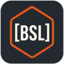

# 1C BSL Analyzer

<p align="center">
  
</p>

Расширение VS Code для разработки на BSL (1C:Enterprise): диагностика, автодополнение, переходы по коду и семантическая подсветка через language server.

## Возможности

- **Диагностика**: анализ BSL-кода во время редактирования
- **Автодополнение**: контекстные подсказки в модулях BSL
- **Переход к определению**: навигация к объявлениям символов
- **Семантическая подсветка**: раскраска кода на основе анализа
- **Автоматическая установка и обновления**: `bsl-analyzer-app` скачивается из GitHub Releases и обновляется через VS Code

## Установка

Установите расширение из VS Code Marketplace или скачайте `.vsix` из [GitHub Releases](https://github.com/itrous/bsl-analyzer-vscode/releases).

При первом запуске расширение автоматически скачает `bsl-analyzer-app`. Версия установленного приложения отображается в строке состояния VS Code. Нажмите на элемент строки состояния или выполните команду **BSL Analyzer: Check for Updates**, чтобы проверить обновления вручную.

## Настройки

| Настройка | По умолчанию | Описание |
|-----------|--------------|----------|
| `bsl-analyzer.server.path` | | Ручной путь к `bsl-analyzer-app`; отключает управляемую загрузку и обновления |
| `bsl-analyzer.server.logFile` | | Путь к файлу логов сервера |
| `bsl-analyzer.server.extraEnv` | `{}` | Дополнительные переменные окружения для процесса сервера |
| `bsl-analyzer.updates.enabled` | `true` | Включить фоновые проверки обновлений |
| `bsl-analyzer.updates.checkIntervalHours` | `12` | Интервал фоновой проверки обновлений в часах |
| `bsl-analyzer.trace.server` | `off` | Трассировка обмена с language server: `off`, `messages`, `verbose` |

## MCP

`bsl-analyzer-app` также можно использовать как MCP-сервер для AI-инструментов. Выполните команду **BSL Analyzer: Copy Server Path**, чтобы получить путь к установленному приложению, и добавьте его в `.mcp.json`:

```json
{
  "mcpServers": {
    "bsl-analyzer": {
      "command": "/path/to/bsl-analyzer-app",
      "args": ["mcp", "--source-dir", "src/cf"]
    }
  }
}
```

## Ссылки

- [BSL Analyzer](https://github.com/itrous/bsl-analyzer)
- [Сообщить о проблеме](https://github.com/itrous/bsl-analyzer-vscode/issues)

## Лицензия

MIT
